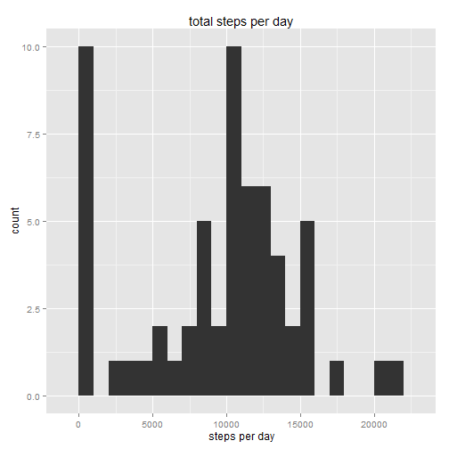
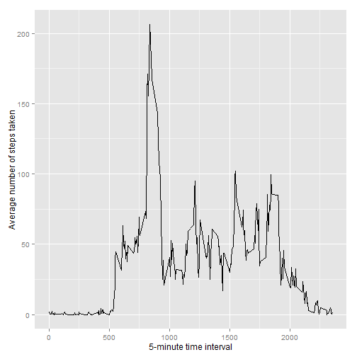
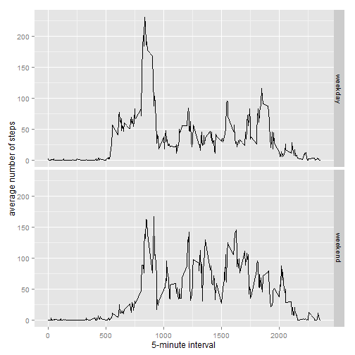

## loading packages


```r
library(plyr)
library(ggplot2)
```

## Loading and preprocessing the data


```r
#The data should be available in the working directory in a file named "activity.zip"
filename <- "activity.zip"

#unzip the file
unzip(filename)

# Read the csv-file and store it into activityRaw
activityRaw <- read.csv("activity.csv")
```


## What is mean total number of steps taken per day?


```r
# first, summarize the total steps per day

steps_sum_days_2<-ddply(activityRaw, c("date"), numcolwise(sum), na.rm=TRUE)

# create a histogram of the total steps per day

qplot(
  steps_sum_days_2$steps, 
  binwidth= 1000, 
  geom="histogram",
  main = "total steps per day",
  xlab = "steps per day"
)
```

 

```r
# calculate mean and median of the total steps per day
mean<- mean(steps_sum_days_2$steps,na.rm = TRUE)
median <- median(steps_sum_days_2$steps,na.rm = TRUE)
```

The mean of the total steps per day is 9354.2295082.

The median of the total steps per day is 10395.


## What is the average daily activity pattern?


```r
# calculate the average number of steps per interval
steps_avg_interval <- aggregate(activityRaw$steps, FUN = mean, by = list(activityRaw$interval), na.rm = TRUE)

# change columnames
colnames(steps_avg_interval) <- c("interval", "avg_steps")

# find maximum of steps and find the interval associated with the max
max_Steps <- max(steps_avg_interval$avg_steps)
intervals <- subset(steps_avg_interval,steps_avg_interval$avg_steps==max_Steps)
max_interval <- intervals$interval[1]

# plot the timeseries
qplot(interval, avg_steps, data = steps_avg_interval, geom = "line", 
      xlab = "5-minute time interval", ylab = "Average number of steps taken")
```

 

The interval with the most average steps is 835

## Imputing missing values

```r
# calculate total number of missing values
total_missing_values <- sum(is.na(activityRaw$steps))
total_missing_values
```

```
## [1] 2304
```

```r
# fill the missing values with the average of the time interval

# make a new dataset where we will fill in the missing values
activityNew <- activityRaw

# identify the rows with missing steps
steps_missing <- which(is.na(activityNew$steps)) 

# identify the intervals of the missing steps
interval_of_steps_missing <- activityNew$interval[steps_missing] 

# find the average steps, corresponding with the interval of the missing steps
new_steps <- steps_avg_interval$avg_steps[match(interval_of_steps_missing, steps_avg_interval$interval)]

# change the missing steps in the average of the interval
activityNew$steps[steps_missing] <- new_steps 

# first, summarize the total steps per day with the new data

steps_sum_days_3<-ddply(activityNew, c("date"), numcolwise(sum), na.rm=TRUE)

# create a histogram of the total steps per day

qplot(
  steps_sum_days_3$steps, 
  binwidth= 1000, 
  geom="histogram",
  main = "total steps per day",
  xlab = "steps per day"
)
```

 

```r
# calculate mean and median of the total steps per day
mean_new<- mean(steps_sum_days_3$steps,na.rm = TRUE)
median_new <- median(steps_sum_days_3$steps,na.rm = TRUE)
```

The mean of the total steps per day with na's removed is 1.0766189 &times; 10<sup>4</sup>.

The median of the total steps per day with na's removed is 1.0766189 &times; 10<sup>4</sup>.

This differs form the mean and median calculated without filling in missing values. The missing values were calculated as 0, therefore the mean was much less then without missing values.

The mean and median are the same. There were only full days with missing values. The missing values were replaced by the mean of that interval over the days and the total of that day is exactly the mean of all filled in days.

## Are there differences in activity patterns between weekdays and weekends?


```r
# use library chron, because it has a convenient function: is.weekend
library(chron)
```

```
## Warning: package 'chron' was built under R version 3.1.1
```

```r
# Obtain a vector which says if a day is a day of the weekend or not
isWeekend <- is.weekend(activityNew$date)

#Create a factor and apply to isWeekend
week_or_weekend <- factor(isWeekend, labels = c('weekday','weekend'))

#Add as new column to the filled activityset
activityNew$week_or_weekend <- week_or_weekend

#Aggregate by week_or_weekend and interval
steps_avg_interval_New <- aggregate(activityNew$steps, by = list(activityNew$week_or_weekend,activityNew$interval), FUN = mean)

# change columnames
names(steps_avg_interval_New) <- c('week_or_weekend','interval','steps')

# create a timeseries plot by factor weekday/weekend
ggplot(steps_avg_interval_New, aes(interval, steps)) + geom_line() + facet_grid(week_or_weekend ~ .) + 
  xlab("5-minute interval") + ylab("average number of steps")
```

 
